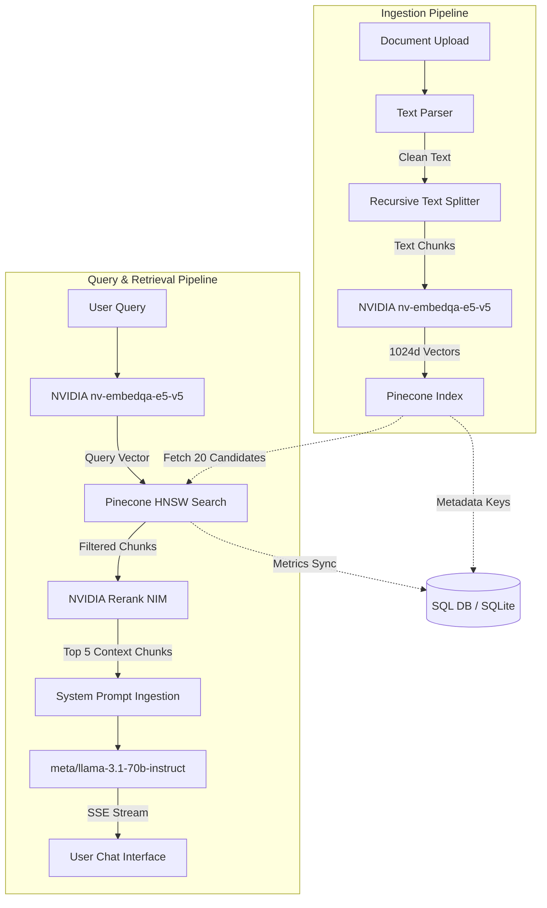

# Production RAG System: Architecture & Integration Blueprint

This document details the architecture, services, components, and pipelines utilized in this Production Retrieval-Augmented Generation (RAG) System.

---

## 1. System Architecture Overview

The system follows a classic **Modular RAG Pipeline** with a decouple-and-scale design:
- **Backend Service:** Asynchronous Python service powered by **FastAPI**, with **SQLAlchemy** (using SQLite `rag_system.db` by default, extensible to Supabase PostgreSQL).
- **Frontend Console:** Dynamic **React / TypeScript / Vite** dashboard styled using Tailwind CSS and custom glassmorphism layers.
- **Neural Stack:** Hosted **NVIDIA NIM APIs** for Embeddings, Reranking, and Large Language Model (LLM) Inference.
- **Vector Storage:** **Pinecone (Serverless)** HNSW-indexed vector space with cosine distance metric similarity.



---

## 2. Ingestion Pipeline & Services

The document ingestion pipeline processes file uploads through five sequential stages: Download, Parse, Chunk, Embed, and Store. High-frequency telemetry updates are streamed live to the UI via WebSockets.

### 2.1 Stage 0 & 1: Download & Text Parsing
- **Storage Backend:** Files are uploaded to local folder storage (`/uploads`) or remote AWS S3 and registered as `pending` in the relational database.
- **Document Routing:**
  - **PDFs:** Handled via `pdfplumber` for text layout extraction, falling back to `pymupdf` for scanning.
  - **OCR Failbacks:** If a PDF is empty (scanned image), `pytesseract` OCR processing runs alongside the `Pillow` image engine.
  - **Word Files:** Parsed dynamically using `python-docx`.

### 2.2 Stage 2: Recursive Semantic Chunking
To preserve narrative structure and context, documents are split recursively using hierarchical separators (`\n\n`, `\n`, sentence bounds `. `, ` `, and `""`).
- **Target Chunk Size:** `512` characters maximum.
- **Overlap Size:** `50` characters shared between adjacent chunks to maintain continuity.

```python
class RecursiveTextSplitter:
    def __init__(self, chunk_size: int = 512, chunk_overlap: int = 50):
        self.chunk_size = chunk_size
        self.chunk_overlap = chunk_overlap
        self.separators = ["\n\n", "\n", ". ", "? ", "! ", " ", ""]
```

### 2.3 Stage 3: Neural Embeddings (NVIDIA NIM)
Chunks are batched in groups of 16 for network efficiency. Chunks are converted into vector representations using the **NVIDIA NIM Embedding API**:
- **Model:** `nvidia/nv-embedqa-e5-v5`
- **Output:** Dense **1024-dimensional** floating-point vectors.

### 2.4 Stage 4: Vector Store & Metadata Envelope
Embeddings are upserted into **Pinecone Serverless**. Each vector contains a detailed metadata envelope to enable filtering and tracing:
```json
{
  "id": "doc_uuid-chunk-index",
  "values": [0.0123, -0.456, "... (1024 dimensions)"],
  "metadata": {
    "doc_id": "document_database_id",
    "original_name": "filename.pdf",
    "file_type": "pdf",
    "chunk_index": 0,
    "char_start": 0,
    "char_end": 508,
    "boundary_level": "paragraph",
    "text": "Extracted text segment preview...",
    "chunk_size": 508
  }
}
```

---

## 3. Retrieval & Generation Pipeline

Query execution is designed for high precision using a two-stage retrieval pattern: HNSW vector search followed by neural reranking.

### 3.1 Step 1 & 2: HNSW Over-Fetch & Filter
- **Query Vectorization:** User query is converted to a 1024d embedding using `nvidia/nv-embedqa-e5-v5`.
- **Over-fetch Strategy:** Pinecone retrieves `top_k * 4` candidates (20 chunks for a `top_k = 5` request) to optimize recall.
- **Similarity Thresholding:** Candidates below a cosine similarity score of `0.3` are discarded. If all items fail, the top 3 matches are returned to prevent complete context loss.

### 3.2 Step 3: Neural Reranking
The query and candidate texts are passed to the **NVIDIA NIM Reranking API**:
- **Reranker Model:** `nvidia/llama-3.2-nv-rerankqa-1b-v2` (Cross-Encoder)
- **Action:** Computes a direct query-context attention matrix, re-scoring each chunk's relevance.
- **Output:** Chunks are re-sorted; the top `top_k` chunks are selected.

### 3.3 Step 4: Faithfulness Evaluation
A proxy faithfulness rating is calculated using the sigmoid of the mean rerank logit score:
$$\text{Faithfulness Score} = \sigma(\mu_{\text{rerank\_logits}}) = \frac{1}{1 + e^{-\mu_{\text{logits}}}}$$

Higher values signify that the retrieved text blocks strongly answer the prompt, indicating a low risk of LLM hallucination.

### 3.4 Step 5: Context Injection & Generation
The selected chunks are injected into a structured system template:
- **Generation Model:** `meta/llama-3.1-70b-instruct` (NVIDIA NIM)
- **Mechanism:** Streams response tokens over a persistent Server-Sent Events (SSE) WebSocket channel.

---

## 4. Pipeline Parameters & Reference

| Parameter Name | Component / Service | Type | Default Value | Operational Impact |
| :--- | :--- | :--- | :--- | :--- |
| `llm_model` | NVIDIA NIM LLM | String | `meta/llama-3.1-70b-instruct` | Determines reasoning and language style. |
| `embedding_model` | NVIDIA NIM Embedding | String | `nvidia/nv-embedqa-e5-v5` | Transforms texts into semantic spaces. |
| `embedding_dimension`| NVIDIA NIM Embedding | Integer | `1024` | Size of dense vector vectors. |
| `reranker_model` | NVIDIA NIM Reranking | String | `nvidia/llama-3.2-nv-rerankqa-1b-v2` | Re-evaluates chunk order relevance. |
| `max_chunk_size` | Text Splitter | Integer | `512` characters | Bounds on chunk text sizes. |
| `chunk_overlap` | Text Splitter | Integer | `50` characters | Overlap buffer size to maintain contexts. |
| `top_k` | Retrieval Pipeline | Integer | `5` chunks | Final context passages fed to LLM. |
| `candidates_mult` | Retrieval Pipeline | Integer | `4` ($k = \text{top\_k} \times 4$) | Magnitude of initial vector over-fetch. |
| `score_threshold` | Pinecone Search | Float | `0.3` | Minimum cosine similarity constraint. |

---

## 5. Metrics & Relational Schemas

Every operational pipeline run writes metric audits to SQL:
- **`IngestionMetrics`**: Logs download, parse, chunk, embed, store, and total time elapsed, along with document lengths and token counts.
- **`QueryMetrics`**: Logs embed, retrieve, rerank, generation, and total query latencies, token counts (prompt, completion, embed), max/mean scores, rerank scores, and faithfulness proxy ratings.

---

## 6. Core RAG Challenges & Architectural Solutions

The system addresses three complex production RAG challenges with modular domain services:

### Challenge 1: Structured Table Layout Preservation (PDF row 14, col 3)
* **Problem**: Normal text splitters break markdown tables across arbitrary character boundaries. If an answer sits in row 14, column 3, standard chunking splits row 14 away from the column headers, causing retrieval to fail because the row values lack semantic context.
* **Architectural Solution**: We implemented the [TableAwareSplitter](file:///D:/Projects/RAG%20System/backend/app/pipeline/table_splitter.py) domain service.
  - During the ingestion pipeline, it identifies markdown tables as distinct, atomic blocks.
  - If a table fits within the `max_chunk_size`, it is kept intact as a single chunk.
  - If a table is too large, it is split row-by-row. Crucially, the splitter injects the table's header lines (column names and separator) into every row chunk.
  - This ensures every single cell value retains its column label in the vector index, guaranteeing high embedding match quality.

### Challenge 2: Retrieval Diversity & Coverage (Avoiding Redundant Top-K)
* **Problem**: Standard semantic searches often retrieve 5 near-duplicate chunks from different parts of a document that repeat the same information. The generator looks highly confident, but lacks coverage of the full question scope.
* **Architectural Solution**: We implemented the [MaximalMarginalRelevanceFilter](file:///D:/Projects/RAG%20System/backend/app/services/diversity_filter.py) (MMR) service in the retrieval flow.
  - We configure the vector query to return a larger candidate pool ($K = \text{top\_k} \times 4$).
  - We fetch the candidate chunk vectors from Pinecone using `include_values=True`.
  - The MMR service filters down candidates by calculating query similarity vs candidate-to-candidate redundancy, penalizing text blocks that are too similar to already selected chunks.
  - Reranking is subsequently run only on this diversified subset.

### Challenge 3: Code-Mixed Query Translation (Hinglish Queries)
* **Problem**: Casual queries are asked in a mixture of Hindi and English (Hinglish), e.g., *"kitna refund milega for cancelled order"*, whereas the documents are in formal English. This vocabulary mismatch leads to low embedding similarity and retrieval failure.
* **Architectural Solution**: We implemented the [QueryTranslator](file:///D:/Projects/RAG%20System/backend/app/services/query_translator.py) service.
  - Before embedding the query, the retrieval pipeline routes the raw query through a fast, deterministic LLM translation step (using `meta/llama-3.1-70b-instruct` at `temp=0.0`).
  - Hinglish queries are rewritten into formal English queries (e.g. *"How much refund will I receive for a cancelled order?"*).
  - The vector index is searched using the formal English query vector for high recall, while the original Hinglish question is passed to the LLM during generation to ensure context-appropriate natural language responses.
