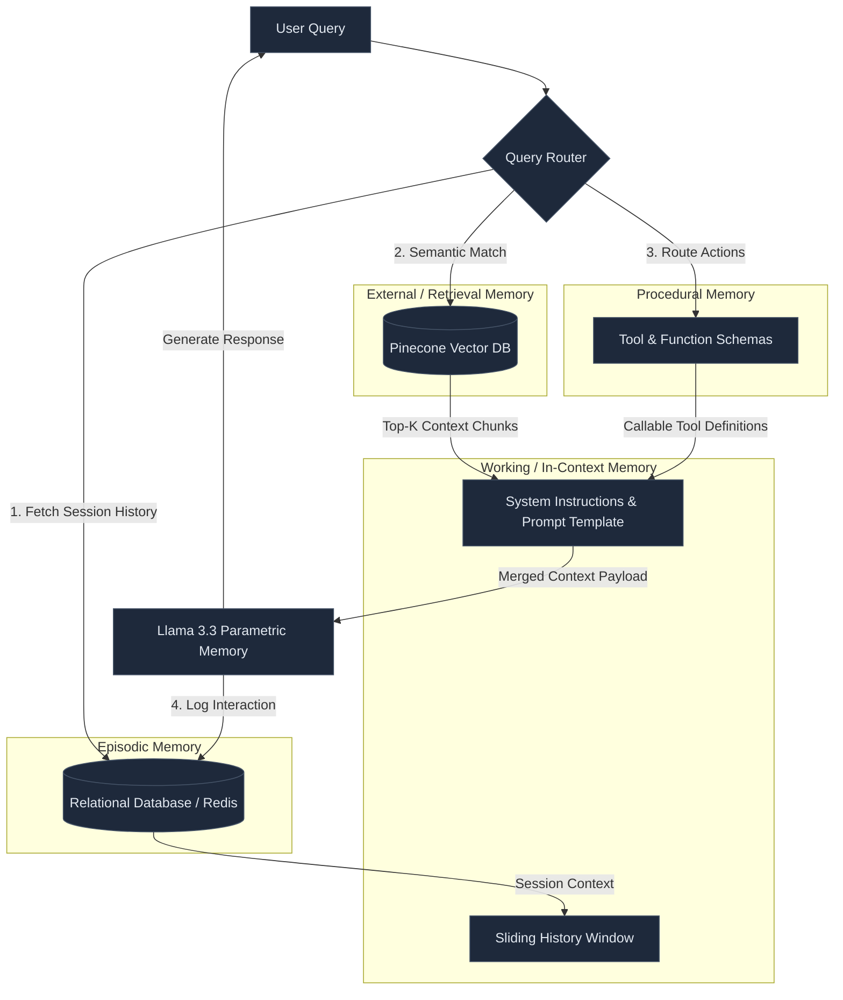

# Architectural Assessment: LLM Memory Paradigms for Production RAG Systems

This document provides a comparative architectural assessment of various Large Language Model (LLM) memory systems and establishes a production-grade blueprint for integrating them into the **Production RAG System** (FastAPI + Pinecone + Llama 3.3 NIM).

---

## 1. Executive Summary & Production Recommendation

In a production-grade Retrieval-Augmented Generation (RAG) system, **no single memory paradigm is sufficient**. Instead, robust architectures leverage a **Hybrid Memory System** where different memory components handle different timescales, latency requirements, and persistence bounds.

For your specific stack (FastAPI, Llama 3.3 Instruct NIM, Pinecone, and relational DB), the recommended production-grade memory architecture is:

1. **Parametric Memory** (Static, embedded in Llama 3.3) for general reasoning and linguistic structure.
2. **External / Retrieval Memory** (Pinecone Serverless) for the massive, dynamic enterprise knowledge base.
3. **In-context / Working Memory** (LLM Context Window) for token-level execution and intermediate reasoning.
4. **Episodic Memory** (Relational DB / Redis) for storing conversation logs and user-session histories.
5. **Procedural Memory** (Codebase & Tool Definitions) for API orchestration and system capabilities.



---

## 2. Memory Paradigms: Detailed Breakdown & Production Viability

### 2.1 Parametric Memory
*   **Definition:** The internal knowledge encoded directly within the model's weights during pre-training and fine-tuning.
*   **Production Viability:** **Essential baseline**, but highly limited for domain-specific tasks.
*   **Pros:** Sub-millisecond lookup (built-in), handles reasoning, syntax, and world knowledge flawlessly.
*   **Cons:** Static (cannot be updated without expensive retraining/fine-tuning), prone to hallucinations on long-tail or proprietary data.
*   **Production Example:** Knowing how to parse JSON or explain general physics concepts.
    ```python
    # Parametric memory handles formatting logic naturally
    prompt = "Format the following user data as a valid JSON object: Name: Aditya, Role: Architect"
    ```

### 2.2 External / Retrieval Memory (RAG)
*   **Definition:** Decoupled knowledge stored in external databases (vector databases, search engines) and retrieved dynamically on demand.
*   **Production Viability:** **Mandatory for Production RAG.** This is the core vector search engine.
*   **Pros:** Infinite capacity, real-time updates (delete/upsert vectors in Pinecone instantly), 100% auditable, protects data privacy via source attribution.
*   **Cons:** Retrieval latency (30–150ms network hop to Pinecone), subject to retrieval quality (recall/precision challenges).
*   **Production Example:** Fetching refund policies from Pinecone using vector embeddings.
    ```python
    # Fetching domain knowledge dynamically from external index
    query_vector = embedding_service.embed("refund policy for cancelled order")
    context_chunks = vector_db.query(vector=query_vector, top_k=5)
    ```

### 2.3 In-Context / Working Memory
*   **Definition:** The temporary workspace provided by the active context window (e.g., Llama 3.3's 128k token context).
*   **Production Viability:** **Mandatory.** The glue that binds queries, history, retrieval results, and prompts.
*   **Pros:** Instantaneous access for the model, highly dynamic, can hold dense multi-turn data.
*   **Cons:** Expensive (high prompt token cost), volatile (wiped after the API call completes), latency scales with context size.
*   **Production Example:** The current prompt template passed to the Llama 3.3 NIM API containing system commands and retrieved text.

### 2.4 Episodic Memory
*   **Definition:** A chronological record of past experiences and interactions (e.g., historical user chats, past tool executions).
*   **Production Viability:** **Highly Recommended** for personalizing and maintaining coherence in multi-turn applications.
*   **Pros:** Builds user trust, permits multi-turn references (e.g., *"like I mentioned earlier"*).
*   **Cons:** Demands session management, token-bloat if full history is passed (requires sliding-window or summary architectures).
*   **Production Example:** Session database tracking user prompts and model responses.
    ```sql
    CREATE TABLE chat_episodes (
        id UUID PRIMARY KEY,
        session_id VARCHAR(255) NOT NULL,
        user_prompt TEXT NOT NULL,
        assistant_response TEXT NOT NULL,
        timestamp TIMESTAMP DEFAULT CURRENT_TIMESTAMP
    );
    ```

### 2.5 Semantic Memory
*   **Definition:** Abstracted, generalized knowledge extracted from episodic memory (e.g., extracting user preferences, facts, or concepts from a long history).
*   **Production Viability:** **Optional but powerful** for advanced agent personalization and GraphRAG architectures.
*   **Pros:** Highly compressed representation of user context, reduces token overhead compared to raw histories.
*   **Cons:** Requires background pipelines (offline workers) to analyze raw chat episodes and distill them into abstract facts.
*   **Production Example:** Storing user preferences extracted dynamically:
    ```json
    {
      "user_id": "usr_90210",
      "abstract_facts": {
        "preferred_language": "Python",
        "environment": "Windows",
        "industry": "Software Engineering"
      }
    }
    ```

### 2.6 Procedural Memory
*   **Definition:** Knowledge of *how* to perform actions (workflows, operational logic, tool call executions).
*   **Production Viability:** **Mandatory for Agentic workflows** (tool calling).
*   **Pros:** Restricts models to safe, deterministic paths; enables connection to internal APIs.
*   **Cons:** High structural sensitivity; if tool specifications are complex, the model may fail to output valid call JSONs.
*   **Production Example:** Defining tools using Pydantic schemas for LLM function calling.
    ```python
    from pydantic import BaseModel, Field

    class OrderRetrieverTool(BaseModel):
        """Tool to retrieve order status from the SQL Database."""
        order_id: str = Field(..., description="The unique 8-character order identifier.")
    ```

### 2.7 Prospective Memory
*   **Definition:** Remembering to perform a deferred action at a specific time or under a specific condition in the future (e.g., *"Follow up if the transaction stays pending"*).
*   **Production Viability:** **Essential for autonomous operations**, but must be managed outside the LLM context.
*   **Pros:** Permits long-running workflows, prevents agents from losing track of async tasks.
*   **Cons:** Cannot be resolved natively by LLMs (models are reactive). Must be implemented via orchestrators (e.g., Celery, Temporal, or DBOS).
*   **Production Example:** Storing a callback task in a task broker that triggers when a specific API event fires or a timer expires.

---

## 3. Comparative Architecture Matrix

| Memory Paradigm | Storage Medium | Latency | Capacity Limit | Production Role | Update Method |
| :--- | :--- | :--- | :--- | :--- | :--- |
| **Parametric** | Neural Weights | $< 1$ms | Fixed by Model Size | Base reasoning & grammar | Fine-tuning / Retraining (Slow/Costly) |
| **Retrieval (RAG)** | Pinecone / Vector DB | $30 - 150$ms | Virtually Infinite | Domain knowledge & Docs | Upserting vector embeddings (Instant/Low Cost) |
| **Working (In-context)** | GPU KV Cache | $0$ms (During run) | $128$k tokens (Llama 3.3) | Active reasoning & execution | Passing text in the API call payload |
| **Episodic** | SQLite / Postgres / Redis | $5 - 15$ms | High (DB Scaling) | Conversational context & logs | Appending chat messages to SQL on reply |
| **Semantic** | Graph DB / Key-Value DB | $10 - 30$ms | Medium | Personalization & Profile | Offline LLM summary job parsing past logs |
| **Procedural** | Codebase / JSON schemas | $0$ms | Limited by Context | Tool calling & API contracts | Modifying codebase and system prompt templates |
| **Prospective** | Task Queues / DBOS / Celery | Event-driven | High | Scheduled actions & reminders | Scheduling background cron jobs/timers |

---

## 4. Production Integration Blueprint (Code Architecture)

To implement this hybrid architecture under **Domain-Driven Design (DDD)** and **Clean Architecture** principles, we create clean, decoupled services. Avoid generic labels like `helpers` or `utils` in favor of domain-focused names.

### 4.1 Episodic Memory Service (`session_episodic_memory.py`)
This service manages dialogue history. To prevent context window bloat, it retrieves only the last $N$ turns or summarizes older history.

```python
# filepath: D:/Projects/RAG System/backend/app/services/session_episodic_memory.py
from typing import List, Dict
from sqlalchemy.orm import Session
# In a real app, import your Session Model
# from app.models.chat_session import ChatMessageModel

class SessionEpisodicMemory:
    """
    Manages episodic chat logs in a relational database, providing
    sliding context window retrievals for LLM working memory.
    """
    def __init__(self, db_session: Session, max_history_turns: int = 6):
        self.db = db_session
        self.max_history_turns = max_history_turns

    def store_episode(self, session_id: str, role: str, content: str) -> None:
        """Saves a single conversation turn (episode) to the database."""
        # Clean architecture separates persistence logic
        # db_record = ChatMessageModel(session_id=session_id, role=role, content=content)
        # self.db.add(db_record)
        # self.db.commit()
        pass

    def retrieve_working_history(self, session_id: str) -> List[Dict[str, str]]:
        """
        Retrieves a windowed representation of recent history to inject 
        into the LLM's active in-context memory.
        """
        # Fetch last N records sorted by time, returned as list of dicts:
        # [{"role": "user", "content": "..."}, {"role": "assistant", "content": "..."}]
        return []
```

### 4.2 External Memory Service (`pinecone_retrieval_memory.py`)
This encapsulates the vector search operations. It connects to Pinecone and applies diversity filters like Maximal Marginal Relevance (MMR).

```python
# filepath: D:/Projects/RAG System/backend/app/services/pinecone_retrieval_memory.py
from typing import List, Dict, Any
from pinecone import Index

class PineconeRetrievalMemory:
    """
    Acts as the external semantic memory interface, queryable via dense embeddings.
    """
    def __init__(self, pinecone_index: Index, embedding_service: Any):
        self.index = pinecone_index
        self.embedding_service = embedding_service

    def search_knowledge(self, query: str, top_k: int = 5) -> List[Dict[str, Any]]:
        """
        Translates query to embedding space and pulls matching candidate contexts.
        """
        query_vector = self.embedding_service.embed_text(query)
        
        # Over-fetch for diversity filtering downstream
        response = self.index.query(
            vector=query_vector,
            top_k=top_k * 4,
            include_metadata=True,
            include_values=True
        )
        
        return self._extract_metadata(response.get("matches", []))

    def _extract_metadata(self, matches: List[Dict[str, Any]]) -> List[Dict[str, Any]]:
        return [
            {
                "text": match["metadata"].get("text", ""),
                "source": match["metadata"].get("original_name", ""),
                "score": match.get("score", 0.0)
            }
            for match in matches
        ]
```

### 4.3 Orchestration Flow (`hybrid_memory_coordinator.py`)
The orchestrator coordinates the different memory systems before sending the prompt payload to Llama 3.3.

```python
# filepath: D:/Projects/RAG System/backend/app/services/hybrid_memory_coordinator.py
from typing import Dict, Any, List
from app.services.session_episodic_memory import SessionEpisodicMemory
from app.services.pinecone_retrieval_memory import PineconeRetrievalMemory

class HybridMemoryCoordinator:
    """
    Orchestrates different memory modules to form the complete
    in-context working memory payload for LLM generation.
    """
    def __init__(
        self,
        episodic_memory: SessionEpisodicMemory,
        retrieval_memory: PineconeRetrievalMemory,
        system_instruction: str
    ):
        self.episodic_memory = episodic_memory
        self.retrieval_memory = retrieval_memory
        self.system_instruction = system_instruction

    def compile_payload(self, session_id: str, user_query: str) -> List[Dict[str, str]]:
        """
        Assembles all memory sources into a single structured list of chat messages.
        """
        # 1. Start with Procedural System Instructions
        messages = [{"role": "system", "content": self.system_instruction}]
        
        # 2. Retrieve Episodic Memory (Session History)
        history = self.episodic_memory.retrieve_working_history(session_id)
        messages.extend(history)
        
        # 3. Retrieve External Memory (RAG Vector Context)
        contexts = self.retrieval_memory.search_knowledge(user_query)
        context_str = "\n---\n".join([c["text"] for c in contexts])
        
        # 4. Inject Context + Current Query into active Working Memory
        user_message_content = f"Context:\n{context_str}\n\nUser Query: {user_query}"
        messages.append({"role": "user", "content": user_message_content})
        
        return messages
```

---

## 5. Architectural Trade-offs & Production Risks

1. **Context Bloat vs. Recall Accuracy:**
   Increasing $K$ (more external contexts) or history turns ($N$ episodic turns) increases the reliability of responses, but scales prompt costs linearly and increases LLM latency. Use **sliding history windows** and **neural rerankers** (like the `nvidia/llama-3.2-nv-rerankqa-1b-v2` in your architecture) to filter down to the top 5 high-relevance chunks.
2. **State Sync Latency:**
   Writing chat episodes to relational databases synchronously blocks the user response stream. Always write new chat histories **asynchronously** to the database after the response stream is initiated.
3. **Hallucinations vs. Parametric Bias:**
   If external memory returns low-quality or irrelevant chunks, the model might fall back on parametric memory (pre-trained assumptions) and hallucinate. Apply strict similarity thresholds (e.g., `score_threshold = 0.3` in your Pinecone setup) and inject clear instructions in your procedural prompt: *"If the context does not contain the answer, reply that you do not know."*
